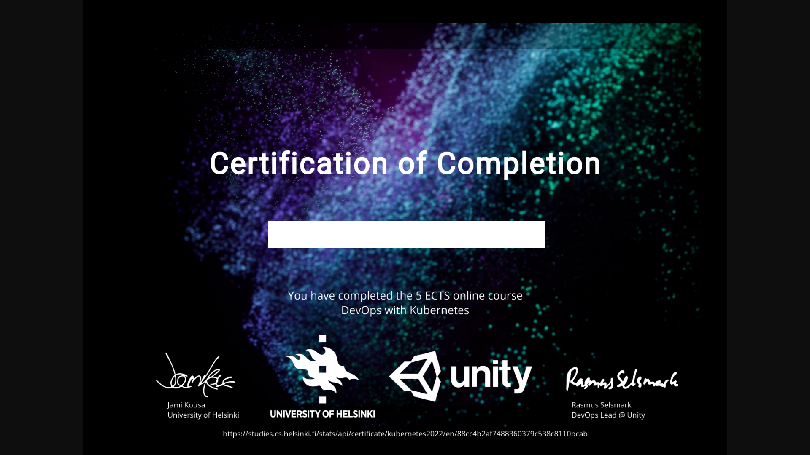

# kubernetes
[Submission application](https://studies.cs.helsinki.fi/stats/courses/kubernetes2022)

## About
University of helsinki kubernetes course - [course page](https://devopswithkubernetes.com/)

All applications not imported are build using nodejs version `v16.15.0`.

All applications has Docker image. Images can be found from [Docker hub - velivalentine](https://hub.docker.com/repositories)

## Table of contents
- [kubernetes](#kubernetes)
  - [About](#about)
  - [Table of contents](#table-of-contents)
  - [Certification](#certification)
  - [Install - dev](#install---dev)
  - [Run production applications](#run-production-applications)
  - [Excerises](#excerises)
    - [part1](#part1)
      - [1.01](#101)
      - [1.02](#102)
      - [1.03](#103)
      - [1.04](#104)
      - [1.05](#105)
      - [1.06](#106)
      - [1.07](#107)
      - [1.08](#108)
      - [1.09](#109)
      - [1.10](#110)
      - [1.11](#111)
      - [1.12](#112)
      - [1.13](#113)
    - [Part 2](#part-2)
      - [2.01](#201)
      - [2.02](#202)
      - [2.03](#203)
      - [2.04](#204)
      - [2.05](#205)
      - [2.06](#206)
      - [2.07](#207)
      - [2.08](#208)
      - [2.09](#209)
      - [2.10](#210)
    - [Part 3](#part-3)
      - [3.01](#301)
      - [3.02](#302)
      - [3.03](#303)
      - [3.04](#304)
      - [3.05](#305)
      - [3.06](#306)
      - [3.07](#307)
      - [3.08](#308)
      - [3.09](#309)
      - [3.10](#310)
    - [Part4](#part4)
      - [4.01](#401)
      - [4.02](#402)
      - [4.03](#403)
      - [4.04](#404)
      - [4.05](#405)
      - [4.06](#406)
      - [4.07](#407)
      - [4.08](#408)
    - [Part 5](#part-5)
      - [5.01](#501)
      - [5.02](#502)
      - [5.03](#503)
      - [5.04](#504)
      - [5.05](#505)
      - [5.06](#506)
  - [Notes](#notes)
    - [k3 cluster](#k3-cluster)
      - [Add cluester](#add-cluester)
      - [Remove cluster](#remove-cluster)
    - [Lens config](#lens-config)
    - [Set namespace](#set-namespace)
    - [Age key gen](#age-key-gen)
    - [SOPS](#sops)
      - [SOPS encryption](#sops-encryption)
      - [SOPS decryption](#sops-decryption)
    - [Grafana](#grafana)
    - [gcloud](#gcloud)
      - [create cluster](#create-cluster)
      - [Enable cluster service](#enable-cluster-service)
      - [delete cluster](#delete-cluster)
    - [flux](#flux)
      - [install](#install)

## Certification


## Install - dev
Intall nvm (node version manager)
```
curl -o- https://raw.githubusercontent.com/nvm-sh/nvm/v0.39.1/install.sh | bash
```
Install node version `v16.15.0`
```
nvm install v16.15.0
```
Open project in new terminal.
Run `npm i`

## Run production applications
Install docker https://docs.docker.com/get-docker/

Pull image from [Docker hub - velivalentine](https://hub.docker.com/repositories).

Run pulled image

## Excerises

### part1

#### 1.01
```
kubectl create deployment log-output --image=velivalentine/log-output:1.01-prod
```

#### 1.02
```
kubectl create deployment todo-app --image=velivalentine/todo-app:v0.1
```

#### 1.03
```
kubectl apply -f part1/log-output/manifests/deployment.yaml
```

#### 1.04
```
kubectl apply -f part1/todo-app/manifests/deployment.yaml
```

#### 1.05
```
kubectl port-forward todo-app-dep-7dbd7bc6b-b85tw 3000:3000
```
Open [http://localhost:3000/health](http://localhost:3000/health)

#### 1.06
```
kubectl apply -f part1/todo-app/manifests/service.yaml
```

#### 1.07
```
kubectl apply -f part1/log-output/manifests/
```
```
kubectl get svc,ing
```

#### 1.08
```
kubectl delete ingress.networking.k8s.io/log-output-ingress
```
```
kubectl apply -f part1/todo-app/manifests/
```
```
kubectl get svc,ing
```

#### 1.09
```
kubectl delete ingress.networking.k8s.io/todo-app-ingress
```
```
kubectl apply \
-f part1/log-output/manifests/ \
-f part1/ping-pong-app/manifests/
```

#### 1.10
```
kubectl apply -f part1/log-output/manifests/
```

#### 1.11
```
kubectl apply \
-f part1/persistentStorage/manifest/ \
-f part1/log-output/manifests/ \
-f part1/ping-pong-app/manifests/
```

#### 1.12
```
kubectl delete -f part1/log-output/manifests/
```
```
kubectl apply -f part1/todo-app/manifests/
```

#### 1.13
```
docker run -d -p 3001:3000 -e IMAGE_FOLDER_PATH='/usr/src/app/images' velivalentine/todo-app:v0.7
```
```
docker run -d -p 80:3000 velivalentine/todo-app-client:v0.7
```

### Part 2

#### 2.01
```
kubectl apply -f log-output/manifests/ -f ping-pong-app/manifests/
```

#### 2.02
```
docker run -d -p 3001:3000 velivalentine/todo-app:v1.0
```
```
docker run -p 3000:80 -e TODO_API_URL=http://localhost:3001 -it velivalentine/todo-app-client:v1.0
```

#### 2.03
```
kubectl create namespace space-1
```
```
kubectl apply \
-f log-output/manifests/ \
-f ping-pong-app/manifests/
```

#### 2.04
```
kubectl create namespace project-1
```
```
kubectl apply \
-f todo-app/manifests/
```

#### 2.05
Nothing to commit. All future secrets shall use age and SOPS encryption

#### 2.06
```
kubectl apply -f log-output/manifests/
```

#### 2.07
```
export SOPS_AGE_KEY_FILE=$(pwd)/../key.txt && \
sops --decrypt secrets/manifest/secret.enc.yaml | kubectl apply -f -
```
```
kubectl apply \
-f postgres/manifest \
-f ping-pong-app/manifests/
```

#### 2.08
```
sops --encrypt \
--age age1s3tm5aglankx9dd9mdekasylal02kpsv03zx3nph38z3mn2azuzqzjpuxc \
--encrypted-regex '^(data)$' \
secrets/manifest/todo.secret.yaml > secrets/manifest/todo.secret.enc.yaml
```
```
export SOPS_AGE_KEY_FILE=~/key.txt && \
sops --decrypt secrets/manifest/todo.secret.enc.yaml | \
kubectl apply -f -
```
```
kubectl apply \
-f todo-postgres/manifest \
-f todo-app/manifests/
```

#### 2.09
```
sh daily-todo/post-todo.sh
```

#### 2.10
```
kubectl -n prometheus port-forward kube-prometheus-stack-1655135423-grafana-6bdb59dbf8-5brpp 3000
```
[http://localhost:3000/explore?orgId=1&left=%7B%22datasource%22:%22Loki%22,%22queries%22:%5B%7B%22refId%22:%22A%22,%22expr%22:%22%7Bapp%3D%5C%22todo-app%5C%22%7D%22%7D%5D,%22range%22:%7B%22from%22:%22now-1h%22,%22to%22:%22now%22%7D%7D](http://localhost:3000/explore?orgId=1&left=%7B%22datasource%22:%22Loki%22,%22queries%22:%5B%7B%22refId%22:%22A%22,%22expr%22:%22%7Bapp%3D%5C%22todo-app%5C%22%7D%22%7D%5D,%22range%22:%7B%22from%22:%22now-1h%22,%22to%22:%22now%22%7D%7D)

### Part 3

#### 3.01
```
sh scripts/part3/3.01.sh
```
```
gcloud container clusters delete dwk-cluster --zone=europe-north1-b
```

#### 3.02
```
sh scripts/part3/3.02.sh
```
```
gcloud container clusters delete dwk-cluster --zone=europe-north1-b
```

#### 3.03
```
gcloud container clusters create dwk-cluster --zone=europe-north1-b --cluster-version=1.22
```
Push something to github
```
gcloud container clusters delete dwk-cluster --zone=europe-north1-b
```

#### 3.04
Create branch and push it to github

#### 3.05
Delete branch on github

#### 3.06
[Database as a Service vs Do It Yourself Database](./document/DBaaS_vs_DIY.md)

#### 3.07
The reason why we chose to use Persistent volume claims with postgreSQL over Google Cloud Sql providers is that we already implemented the persisten volumen database. 

Given the life expectancy of this project there is no benefits of switchin to Google cloud Sql provier. Also the added cost and limited resources are currently issue ($$$).

#### 3.08
```
sh scripts/part3/3.08.sh
```

#### 3.09
```
kubectl create namespace space-1
```

```
export SOPS_AGE_KEY_FILE=$(pwd)/../key.txt
sops --decrypt secrets/manifest/secret.enc.yaml | kubectl apply -f -
```
```
kubectl apply \
-f postgres/manifest/ \
-f log-output/manifests/ \
-f ping-pong-app/manifests/
```

#### 3.10

[Picture of logs](./document/pictures/logs-screenschot.png)

https://console.cloud.google.com/logs/query;query=resource.type%3D%22k8s_container%22%0Aresource.labels.project_id%3D%22dwk-gke-353608%22%0Aresource.labels.location%3D%22europe-north1-b%22%0Aresource.labels.cluster_name%3D%22dwk-cluster-2%22%0Aresource.labels.namespace_name%3D%22project-1%22%0Alabels.k8s-pod%2Fapp%3D%22todo-app%22;timeRange=PT30S;cursorTimestamp=2022-06-18T15:34:41.822997983Z?project=dwk-gke-353608

### Part4

#### 4.01
```
kubectl apply -f log-output/manifests/ -f ping-pong-app/manifests/
```
```
kubectl get po -n space-1
```
```
kubectl apply -f postgres/manifest/
```

#### 4.02
```
kubectl apply -k .
```
```
kubectl delete -f todo-postgres/manifest/
```

#### 4.03
```
sh scripts/port-forward-prometheus.sh
```

[Query result](http://localhost:9090/api/v1/query?query=count%28kube_pod_info%7Bnamespace%3D%22prometheus%22%2Ccreated_by_kind%3D%22StatefulSet%22%7D%29)

#### 4.04
```
kubectl apply -n argo-rollouts -f https://github.com/argoproj/argo-rollouts/releases/latest/download/install.yaml
```
```
kubectl apply -k .
```

#### 4.05
```
kubectl apply -k .
```

#### 4.06
Define endpoint env-variable for broadcast server to see created/uptaded todos. [Broadcaster README.md](./broadcaster/README.md)
```
helm repo add nats https://nats-io.github.io/k8s/helm/charts/
```

```
helm repo update
```

```
helm install -n project-1 my-nats nats/nats
```

```
kubectl apply -k .
```

#### 4.07
```
kubectl apply -f app/manifest/secrets/secret.yaml
```

#### 4.08
```
kubectl apply -f project/manifest/secrets/secret.yaml
```
Bonus using sops secret with flux not done. How to do -> https://fluxcd.io/docs/guides/mozilla-sops/

### Part 5

#### 5.01
```
kubectl apply -k dummySite/manifest/
```

Get the bearer token and add it to deployment
```
sh scripts/bearer-tokens.sh
```

Apply deployment and dummysite
```
kubectl apply \
-f dummySite/manifest/deployment.yaml \
-f dummySite/manifest/dummySite.yaml
```

```
sh scripts/dummyPortForward.sh
```

Open dummysite [http://localhost:3000](http://localhost:3000)


#### 5.02
```
kubectl get -n project-1 deploy -o yaml | linkerd inject - | kubectl apply -f -
```
```
linkerd viz dashboard &
```

#### 5.03
[./document/5.03/README.md](./document/5.03/README.md)

#### 5.04
[PLATFORM_COMPARISON.md](./document/PLATFORM_COMPARISON.md)

#### 5.05
```
k3d cluster delete
```
```
k3d cluster create --port 8082:30080@agent:0 -p 8081:80@loadbalancer --agents 2 --k3s-arg "--disable=traefik@server:0"
```
```
kubectl apply -f app/manifest/secrets/secret.yaml -n space-1
```
```
kubectl apply -k app/manifest/
```
```
kubectl get po -n space-1 --watch
```
```
kubectl get ksvc -n space-1
```
```
curl -H "Host: pingpong-serverless.space-1.example.com" http://localhost:8081
```

#### 5.06


The most red circles were used outside of this cource. There must be a lot of dependencies that I used during this cource that I don't recognize from the image.

Also some of the circled products I used during this cource but also from previous cources and from work.

The ones I did recognized from this cource are
- postgres sql
  - used as sql database during the project applications
- kafka. Not sure when we used this. It sounded familiar.
- nats
  - used in project application to connect different services
- helm
  - used to install custom resources to out kubernetes cluster
- github actions
  - used to create and publish images based on version controll
  - also used outside of this cource
- k3s
  - our local kubernetes cluster manager
- kubernetes
  - the way to go
- traefik proxy (most like used as dependency)
  - I think kubernetes services used this
- google container registery
  - used to store some of our images

## Notes
```

```

### k3 cluster

#### Add cluester
```
k3d cluster create --port 8082:30080@agent:0 -p 8081:80@loadbalancer --agents 2
```
#### Remove cluster
```
k3d cluster delete
```

### Lens config
```
kubectl config view --minify --raw > config.log
```

### Set namespace
`kubectl config set-context --current --namespace=`

### Age key gen
```
age-keygen -o key.txt
```

### SOPS

#### SOPS encryption
```
sops --encrypt \
       --age age_public_key \
       --encrypted-regex '^(data)$' \
       file_to_encrypt.yaml > encrypted_file.enc.yaml
```
#### SOPS decryption
```
export SOPS_AGE_KEY_FILE=$(pwd)/key.txt
```
```
sops --decrypt secret.enc.yaml | kubectl apply -f -
```

### Grafana
```
kubectl get po -n prometheus
```
```
kubectl -n prometheus port-forward kube-prometheus-stack-1654964728-grafana-646c7f7965-xtdkn 3000
```

### gcloud

#### create cluster
```
gcloud container clusters create <CLUSTER-ID> --zone=europe-north1-b --cluster-version=1.22
```

#### Enable cluster service
```
gcloud services enable container.googleapis.com
```

#### delete cluster
```
gcloud container clusters delete <CLUSTER-ID> --zone=europe-north1-b
```

### flux
#### install
```
flux bootstrap github \
    --owner=veliValentine\
    --repository=kubernetes \
    --personal \
    --private=false
```


```
```